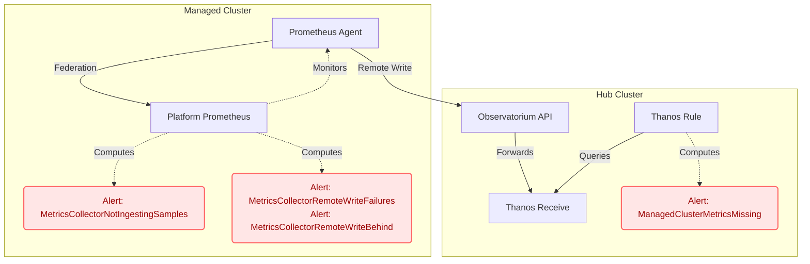

# Elevating Fleet Observability: Unmatched Network Resiliency and Health Detection

The transition to the **MultiCluster Observability Addon (MCOA)** introduces critical operational improvements for enterprise fleet monitoring, specifically targeting network reliability and closing crucial blind spots in telemetry health.

## Improved Network Resiliency

MCOA drastically improves how metrics are handled during connectivity disruptions by utilizing a standard **Prometheus remote-write implementation**. 

At the core of this resiliency is the **Prometheus Agent**, which uses a local **Write Ahead Log (WAL)** to securely buffer federated metric samples on the managed cluster's disk. This architecture ensures:

* **Data Preservation:** If network connectivity is temporarily lost, your data is preserved locally until the connection is restored.
* **Buffer Capacity:** Provides robust resiliency against network partitions between managed clusters and the centralized hub for **up to one hour** without any data loss.

## Comprehensive Cluster Health Detection

There are two primary ways users can monitor the health of the observability addon:

* **The Addon Health Feature:** The first method leverages the standard Open Cluster Management (OCM) health probe. For MCOA, this feature ensures the platform Prometheus agent workload (and the user workload agent, if defined) is running, degrading the status in the OCP console if essential resources are missing or down.
* **Targeted Alerts:** While the health feature effectively ensures the agent is up and running, it leaves a potential blind spot: the agent could be running but silently failing to forward metrics to the hub due to network issues, authentication failures, or internal crashes. As a crucial complement, MCOA defines a multi-layered set of targeted alerts to cover these other failure modes by monitoring the actual flow of telemetry data.

### Architecture Overview

### 1. Managed Cluster-Side Alerting

The following alerting rules are evaluated directly on the managed clusters to catch pipeline issues at the source:

* **MetricsCollectorNotIngestingSamples:** Fires when the Prometheus agent fails to federate any metrics locally.
* **MetricsCollectorRemoteWriteFailures:** Fires when the Prometheus agent experiences a high failure rate on remote write requests to the hub.
* **MetricsCollectorRemoteWriteBehind:** Fires when the remote write process is too slow, indicating potential network latency or a struggling hub receiver.

### 2. Hub-Side Alerting (New)

To provide a fail-safe against total communication loss—where even alert forwarding from a managed cluster is broken—a new alert is evaluated by the central hub itself:

* **ManagedClusterMetricsMissing:** This alert fires if the hub receives no metrics from a managed cluster for **15 minutes**, even though its add-on lease is reporting as available. By only targeting available clusters, it prevents alert fatigue from clusters already known to be degraded.

Together, these enhancements guarantee that platform administrators are immediately notified of true telemetry health, completely eliminating **silent failures** in the enterprise observability pipeline.
